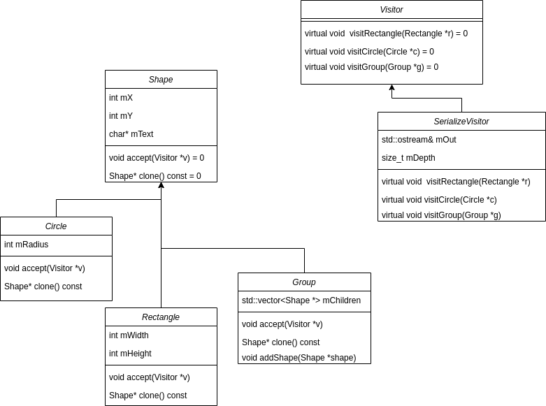
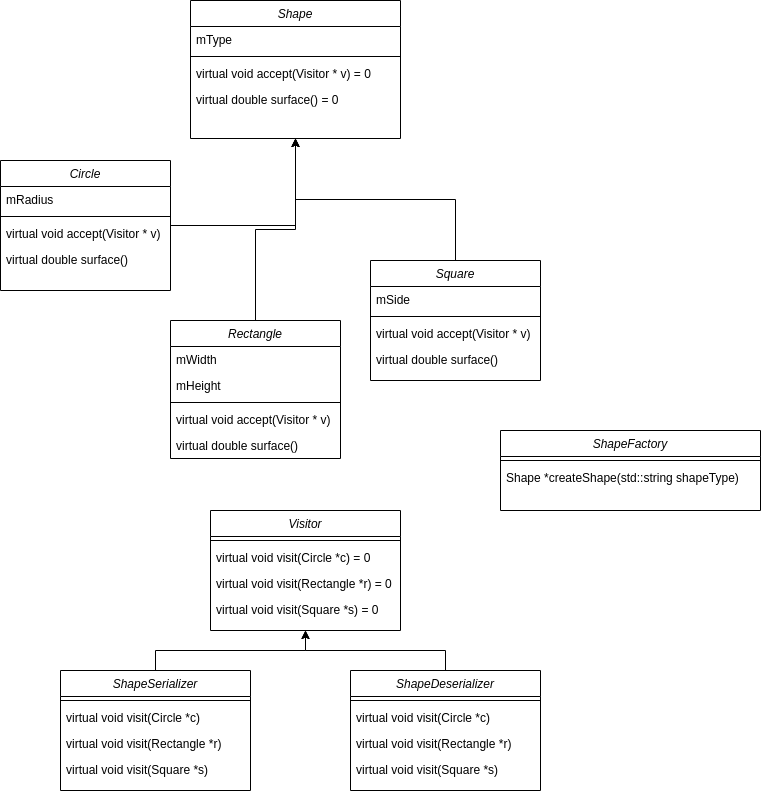

# Задачи

> Задача 1

(**Visitor**) Да се създаде следната система за манипулация на фигури в 2D пространството:

Всяка фигура е от базов тип `Shape`, като има следните данни:
- Координата спрямо абсцисата
- Координата спрямо ординатата
- Label

и следните методи:
- Голяма четворка
- Виртуален copy constructor
- Setters & getters
- virtual void accept(Visitor *) - напълно виртуален метод

Поддържаните фигури са следните:
- фигура `Circle`, зададена с радиус
- фигура `Rectangle`, зададена с височина и ширина
- фигура `Group`, зададена с масив от фигури

Да се реализира клас `SerializeVisitor`, наследник на `Visitor` със следните член-данни:
- Depth – число, което показва вложеността на фигурите
- Out – поток за извеждане на данните за фигурите, създадени от системата

като идеята е да може да сериализира фигурите в текстови файл, така че визуално да може да се разбере, коя фигура в коя група от фигури участва.



> Задача 2

(**Factory**)Да се създаде, подобна на горната задача, система за фигури, но:

базовият тип `Shape` съдържа само данната **Type** и методи:
- virtual accept() – приема указател към Visitor
- virtual surface() – връща лицето на фигурата

Поддържаните фигури са следните:
- фигура `Circle`, зададена с радиус
- фигура `Rectangle`, зададена с височина и ширина
- фигура `Square`, зададена с дължина на страната

Да се създадат 2 класа, наследяващи `Visitor` - `ShapeSerializer` и `ShapeDeserializer` - които ще са отговорни съответно за сериализацията и десериализацията на фигурите.

Създайте клас `ShapeFactory` - който ще има един статичен метод createShape(std::string shapeType), който приема тип на фигура и връща съответен обект в динамичната памет.

Да се създаде подходящ пример, който записва масив от фигури във файл и после прочита фигури от файл, като се използва **ShapeFactory**!



> Задача 3 Revolut 💳

Ще създадем приложение за банкови услуги, подобно на Revolut, което ще менажира сметки, карти и разплащания. Приложението ще има следните основни функционалности:

- менажиране на сметки в лева и евро
- менажиране на банкови карти
- добаване и трансфериране на пари между сметки
- плащания

Създайте клас **Revolut** с конструктор Revolut(std::vector<Account> accounts, std::vector<Card> cards), който имплементира следния интерфейс:

``` c++ 
class RevolutAPI {
public:
    /**
     * Executes a card payment using a POS terminal
     *
     * @param card the card used for the payment. Only physical cards are accepted
     * @param pin 4-digit PIN
     * @param amount the amount paid
     * @param currency the currency of the payment ("BGN" or "EUR")
     * @return true, if the operation is successful and false otherwise.
     *         Payment is successful, if the card is available in Revolut, valid, unblocked,
     *         the specified PIN is correct and an account with sufficient amount in the specified currency exists.
     *         In case of three consecutive incorrect PIN payment attempts, the card should be blocked.
     **/
    virtual bool pay(Card card, int pin, double amount, std::std::string currency) = 0;

    /**
     * Executes an online card payment
     *
     * @param card the card used for the payment. Any type of card is accepted
     * @param pin 4-digit PIN
     * @param amount the amount paid
     * @param currency the currency of the payment ("BGN" or "EUR")
     * @param shopURL the shop's domain name. ".biz" top level domains are currently banned and payments should be rejected
     * @return true, if the operation is successful and false otherwise.
     *         Payment is successful, if the card is available in Revolut, valid, unblocked,
     *         the specified PIN is correct and an account with sufficient amount in the specified currency exists.
     *         In case of three consecutive incorrect PIN payment attempts, the card should be blocked.
     **/
    virtual bool payOnline(Card card, int pin, double amount, std::std::string currency, std::std::string shopURL) = 0;

    /**
     * Adds money to a Revolut account
     *
     * @param account the account to debit
     * @param amount the amount to add to the account, in the @account's currency
     * @return true, if the acount exists in Revolut and false otherwise
     **/
    virtual bool addMoney(Account account, double amount) = 0;

    /**
     * Transfers money between accounts, doing currency conversion, if needed.
     * The official fixed EUR to BGN exchange rate is 1.95583.
     *
     * @param from the account to credit
     * @param to the account to debit
     * @param amount the amount to transfer, in the @from account's currency
     * @return true if both accounts exist and are different (with different IBANs) and false otherwise
     **/
    virtual bool transferMoney(Account from, Account to, double amount) = 0;

    /**
     * Returns the total available amount
     *
     * @return The total available amount (the sum of amounts for all accounts), in BGN
     **/
    virtual double getTotalAmount() = 0;

};
```
Карти
Revolut поддържа три типа карти - физически, виртуални и виртуални за еднократна употреба.

- физическите карти могат да се ползват за всякакъв вид плащания (online и с POS терминал)
- виртуалните карти могат се ползват само за онлайн плащания
- виртуалната карта за еднократна употреба е валидна за едно-единствено плащане, след което се блокира.

Трите типа карти са реализирани съответно от конкретните класове **PhysicalCard**, **VirtualPermanentCard** и **VirtualOneTimeCard**, имплементиращи интерфейс **Card**.

``` c++
class Card {
public:
    /**
     * @return the type of the card: "PHYSICAL", "VIRTUALPERMANENT" or "VIRTUALONETIME"
     **/
    virtual std::string getType() = 0;

    /**
     * @return the card's expiration date
     **/
    virtual Date getExpirationDate() = 0;

    /**
     * @return true if the PIN is correct and false otherwise. Correct means, equal to the PIN, set in the card upon construction (i.e. passed in its constructor). You can check it for validity, e.g. that it is a 4-digit number, but you can assume the input is valid.
     **/
    virtual bool checkPin(int pin) = 0;

    /**
     * @return true if the card is blocked and false otherwise
     **/
    virtual bool isBlocked() = 0;

    /**
     * Blocks the card
     **/
    virtual void block() = 0;

};
```

И трите имплементации на Card трябва да имат конструктор с параметри (std::string number, int pin, Date expirationDate).

Сметки
Поддържат се сметки в лева и евро, имплементирани съответно от конкретните класове **BGNAccount** и **EURAccount**, наследяващи абстрактния клас **Account**.

``` c++
class Account {
private:
    double amount;
    std::string IBAN;
public:
    ... 
    virtual std::string getCurrency() = 0;
}
```

В класическите банки, всяка карта е свързана с конкретна сметка. В Revolut обаче, и картите, и сметките, са свързани със самия Revolut, а не директно една с друга. Когато осъществяваме плащане, валидираме подадената карта, и при успешна валидация, обхождаме сметките и търсим такава в исканата валута и с необходимата минимална наличност.